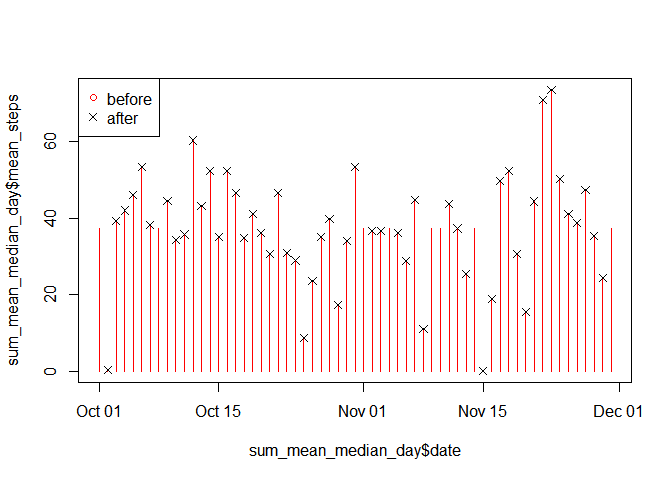

# Course Project 1 Reproducible Research
Parag Sengupta  
May 18, 2017  

Setting global options and working directory


```r
library(knitr)
setwd("D:/DataScienceJohnHopkins/Reproducible Research/CourseProject1")
knitr::opts_chunk$set(echo = TRUE)
knitr::opts_chunk$set(warning=FALSE)
```

Loading and preprocessing the data
==================================

Show any code that is needed to

(1) Load the data (i.e. read.csv())

The first line of the data file "activity.csv" has all the variable names and na.strings is to be set as "NA".


```r
if(!file.exists("repdata_data_activity.zip")) {
      temp <- tempfile()
      download.file("https://d396qusza40orc.cloudfront.net/repdata%2Fdata%2Factivity.zip",temp)
      unzip(temp)
      unlink(temp)
}
activity <- read.csv("activity.csv")
str(activity)
```

```
## 'data.frame':	17568 obs. of  3 variables:
##  $ steps   : int  NA NA NA NA NA NA NA NA NA NA ...
##  $ date    : Factor w/ 61 levels "2012-10-01","2012-10-02",..: 1 1 1 1 1 1 1 1 1 1 ...
##  $ interval: int  0 5 10 15 20 25 30 35 40 45 ...
```

```r
head(activity)
```

```
##   steps       date interval
## 1    NA 2012-10-01        0
## 2    NA 2012-10-01        5
## 3    NA 2012-10-01       10
## 4    NA 2012-10-01       15
## 5    NA 2012-10-01       20
## 6    NA 2012-10-01       25
```

```r
tail(activity)
```

```
##       steps       date interval
## 17563    NA 2012-11-30     2330
## 17564    NA 2012-11-30     2335
## 17565    NA 2012-11-30     2340
## 17566    NA 2012-11-30     2345
## 17567    NA 2012-11-30     2350
## 17568    NA 2012-11-30     2355
```

(2) Process/transform the data (if necessary) into a format suitable for your analysis.

Tranfer the date value to data format, which will be used later.


```r
library(dplyr)
activity <- mutate(activity, date = as.Date(as.character(date), "%Y-%m-%d"))
```

What is mean total number of steps taken per day?
================================================

(1) Calculate the total number of steps taken per day.

Two options: Either use group_by and summarise functions of dplyr package or use aggregate function to arrive our aim. Here, the latter is used.


```r
steps_per_day <- aggregate(steps ~ date, data = activity, sum, na.rm = TRUE)
```

(2) If you do not understand the difference between a histogram and a barplot, research the difference between them. 

Difference: a histogram is useful to look at when one want to see more detail on the distribution of a data. The barplot is useful for summarizing categorical data. Following shows the difference between the two types of plots (just as an example)


```r
example <- c(1,2,3,2)
par(mfrow = c(1,2))  # number of plots per row    
hist(example, breaks = 8, col = "green", main = "Plot with hist()")  # plot by hist()
barplot(example, col = "blue", main = "Plot with barplot()")  # plot by barplot
```

<!-- -->

Make a histogram of the total number of steps taken each day

The histogram helps to investigate the steps distributions.


```r
hist(steps_per_day$steps, main = "Histogram of the total steps taken per day", xlab = "Steps", breaks = 16, col = "wheat")
```

<!-- -->

(3) Calculate and report the mean and median of the total number of steps taken per day.

The group_by and summarise/summarize functions of package dplyr are more convinent here.


```r
library(dplyr)
mean_median_steps_per_day <- group_by(activity, date) %>%
    summarise(mean = mean(steps, na.rm = TRUE),
              median = median(steps, na.rm = TRUE))
summary(mean_median_steps_per_day)
```

```
##       date                 mean             median 
##  Min.   :2012-10-01   Min.   : 0.1424   Min.   :0  
##  1st Qu.:2012-10-16   1st Qu.:30.6979   1st Qu.:0  
##  Median :2012-10-31   Median :37.3785   Median :0  
##  Mean   :2012-10-31   Mean   :37.3826   Mean   :0  
##  3rd Qu.:2012-11-15   3rd Qu.:46.1597   3rd Qu.:0  
##  Max.   :2012-11-30   Max.   :73.5903   Max.   :0  
##                       NA's   :8         NA's   :8
```

```r
# head(mean_median_steps_per_day)
# tail(mean_median_steps_per_day)
dim(mean_median_steps_per_day)
```

```
## [1] 61  3
```

What is the average daily activity pattern?
==========================================

(1) Make a time series plot (i.e. type = "l") of the 5-minute interval (x-) and the average number of steps taken, averaged across all days (y-axis)

(2) Which 5-minute interval, on average across all the days in the dataset, contains the maximum number of steps?


```r
library(dplyr)
interval_steps <- group_by(activity, interval) %>% summarise(mean = mean(steps, na.rm = TRUE))

# The time series plot
with(interval_steps, 
     plot(interval, mean, 
          type = "l", 
          col = "brown", 
          xlab = "5-minute interval",
          ylab = "Average number of steps taken per time interval"))
```

<!-- -->

```r
# The maximum number of steps
max_steps_interval <- interval_steps[which.max(interval_steps$mean), ]$interval
max_steps_interval
```

```
## [1] 835
```

Above calculation shows that the 5-minute interval 835 contains the maximum number of steps.

Imputing missing values
=======================

Note that there are a number of days/intervals where there are missing values, coded as NA. The presence of missing days may introduce bias into some calculations or summaries of the data.

(1) Calculate and report the total number of missing values in the dataset, i.e. the total number of rows with NA.

First check on every column of the data activity, aiming to detect the NA values.


```r
any(is.na(activity$steps))
```

```
## [1] TRUE
```

```r
any(is.na(levels(activity$date)))
```

```
## [1] FALSE
```

```r
any(is.na(activity$interval))
```

```
## [1] FALSE
```

Only the column "steps"" in activity contains NAs. 


```r
NA_total <- sum(is.na(activity$steps))
NA_proportion <- sum(is.na(activity$steps)) / nrow(activity)
NA_total
```

```
## [1] 2304
```

```r
NA_proportion
```

```
## [1] 0.1311475
```

The total number of rows in column "steps" with missing values is 2304. It has a proportion of 13.11475% of the total data set population.

(2) Devise a strategy for filling in all of the missing values in the dataset. The strategy does not need to be sophisticated. For example, you could use the mean/median for that day, or the mean for that 5-minute interval, etc.

The strategy: Given a NA step value, first try to fill it with the median of that day. If this median result is also NA, then fill it with the mean for that 5-minute interval. In the end, check the NA values of the new data.

(3) Create a new dataset that is equal to the original dataset but with the missing data filled in.


```r
activity_copy <- activity  # for a protection of the original data
rm(activity)  # release the memory
l <- nrow(activity_copy)
for (i in 1:l) {
    if (is.na(activity_copy$steps[i])) {
        today = activity_copy$date[i]
        sub_value = mean_median_steps_per_day[mean_median_steps_per_day$date == today, "median"]
        if (!is.na(sub_value)) {
            activity_copy$steps[i] = sub_value
        } else {
            pattern = activity_copy$interval[i]
            sub_value = interval_steps[interval_steps$interval == pattern, "mean"]
            activity_copy$steps[i] = sub_value
        }
    }
}
sum(is.na(activity_copy$steps))
```

```
## [1] 0
```

```r
# summary(activity_copy)
head(activity_copy)
```

```
##       steps       date interval
## 1  1.716981 2012-10-01        0
## 2 0.3396226 2012-10-01        5
## 3 0.1320755 2012-10-01       10
## 4 0.1509434 2012-10-01       15
## 5 0.0754717 2012-10-01       20
## 6   2.09434 2012-10-01       25
```

The str(activity_copy) result shows that the format of the column "steps" is list. Convert it to numeric first


```r
activity_copy <- mutate(activity_copy, steps = as.numeric(steps))
write.csv(activity_copy, file = "activity_copy.csv") # save the new data
```

(4) Make a histogram of the total number of steps taken each day.
Calculate and report the mean and median total number of steps taken per day. 

Do these values differ from the estimates from the first part of the assignment? What is the impact of imputing missing data on the estimates of the total daily number of steps?


```r
library(dplyr)
sum_mean_median_day <- group_by(activity_copy, date) %>%
    summarise(sum_steps = sum(steps),
              mean_steps = mean(steps),
              median_steps = median(steps))
sum_mean_median_day
```

```
## # A tibble: 61 × 4
##          date sum_steps mean_steps median_steps
##        <date>     <dbl>      <dbl>        <dbl>
## 1  2012-10-01  10766.19   37.38260     34.11321
## 2  2012-10-02    126.00    0.43750      0.00000
## 3  2012-10-03  11352.00   39.41667      0.00000
## 4  2012-10-04  12116.00   42.06944      0.00000
## 5  2012-10-05  13294.00   46.15972      0.00000
## 6  2012-10-06  15420.00   53.54167      0.00000
## 7  2012-10-07  11015.00   38.24653      0.00000
## 8  2012-10-08  10766.19   37.38260     34.11321
## 9  2012-10-09  12811.00   44.48264      0.00000
## 10 2012-10-10   9900.00   34.37500      0.00000
## # ... with 51 more rows
```

```r
summary(sum_mean_median_day)
```

```
##       date              sum_steps       mean_steps       median_steps   
##  Min.   :2012-10-01   Min.   :   41   Min.   : 0.1424   Min.   : 0.000  
##  1st Qu.:2012-10-16   1st Qu.: 9819   1st Qu.:34.0938   1st Qu.: 0.000  
##  Median :2012-10-31   Median :10766   Median :37.3826   Median : 0.000  
##  Mean   :2012-10-31   Mean   :10766   Mean   :37.3826   Mean   : 4.474  
##  3rd Qu.:2012-11-15   3rd Qu.:12811   3rd Qu.:44.4826   3rd Qu.: 0.000  
##  Max.   :2012-11-30   Max.   :21194   Max.   :73.5903   Max.   :34.113
```

```r
# Now we plot histograms of the total steps taken per day AFTER and BEFORE the filling of missing data.

hist(sum_mean_median_day$sum_steps, main = "Histogram of the total steps per day AFTER missing data filling", xlab = "Steps", breaks = 16, col = "brown")
```

<!-- -->

```r
hist(steps_per_day$steps, main = "Histogram of the total steps per day BEFORE missing data filling", xlab = "Steps", breaks = 16, col = "blue", ylim = c(0,15))
```

<!-- -->

```r
# Next we plot the mean steps taken per day AFTER and BEFORE the filling of missing data.

plot(sum_mean_median_day$date, sum_mean_median_day$mean_steps, type = "h", pch = 1, col = "red")
points(mean_median_steps_per_day$date, mean_median_steps_per_day$mean, pch = 4)
legend("topleft", pch = c(1,4), col = c("red", "black"), legend = c("before", "after"))
```

<!-- -->

The red vertical lines without crosses on the top indicates the missing values in the original data.

Are there differences in activity patterns between weekdays and weekends?
========================================================================

For this part the weekdays function may be of some help here. Use the dataset with the filled-in missing values for this part.

(1) Create a new factor variable in the dataset with two levels - "weekday" and "weekend" indicating whether a given date is a weekday or weekend day


```r
class(activity_copy$date)
```

```
## [1] "Date"
```

```r
state <- ifelse(weekdays(activity_copy$date) %in% c("Saturday", "Sunday"), "weekend", "weekday")
state <- as.factor(state)
activity_copy$state <- state
str(activity_copy)
```

```
## 'data.frame':	17568 obs. of  4 variables:
##  $ steps   : num  1.717 0.3396 0.1321 0.1509 0.0755 ...
##  $ date    : Date, format: "2012-10-01" "2012-10-01" ...
##  $ interval: int  0 5 10 15 20 25 30 35 40 45 ...
##  $ state   : Factor w/ 2 levels "weekday","weekend": 1 1 1 1 1 1 1 1 1 1 ...
```

(2) Make a panel plot containing a time series plot (i.e. type = "l") of the 5-minute interval (x-axis) and the average number of steps taken, averaged across all weekday days or weekend days (y-axis). See the README file in the GitHub repository to see an example of what this plot should look like using simulated data


```r
library(dplyr)
average_steps_state <- group_by(activity_copy, state, interval) %>%
    summarise(average_steps = mean(steps))
str(average_steps_state)
```

```
## Classes 'grouped_df', 'tbl_df', 'tbl' and 'data.frame':	576 obs. of  3 variables:
##  $ state        : Factor w/ 2 levels "weekday","weekend": 1 1 1 1 1 1 1 1 1 1 ...
##  $ interval     : int  0 5 10 15 20 25 30 35 40 45 ...
##  $ average_steps: num  2.251 0.445 0.173 0.198 0.099 ...
##  - attr(*, "vars")=List of 1
##   ..$ : symbol state
##  - attr(*, "drop")= logi TRUE
```

```r
library(ggplot2)
g <- ggplot(average_steps_state, aes(x = interval, y = average_steps)) +
    geom_line() + 
    facet_grid(state ~ .) + 
    labs(x = "Interval") + 
    labs(y = "Number of steps")
g
```

<!-- -->

```r
# plot above picture again using lattice system.
library(lattice)
xyplot(average_steps ~ interval | state, data = average_steps_state, type = "l", layout = c(1,2), xlab = "Interval", ylab = "Number of steps")
```

<!-- -->

End of Project
==============

